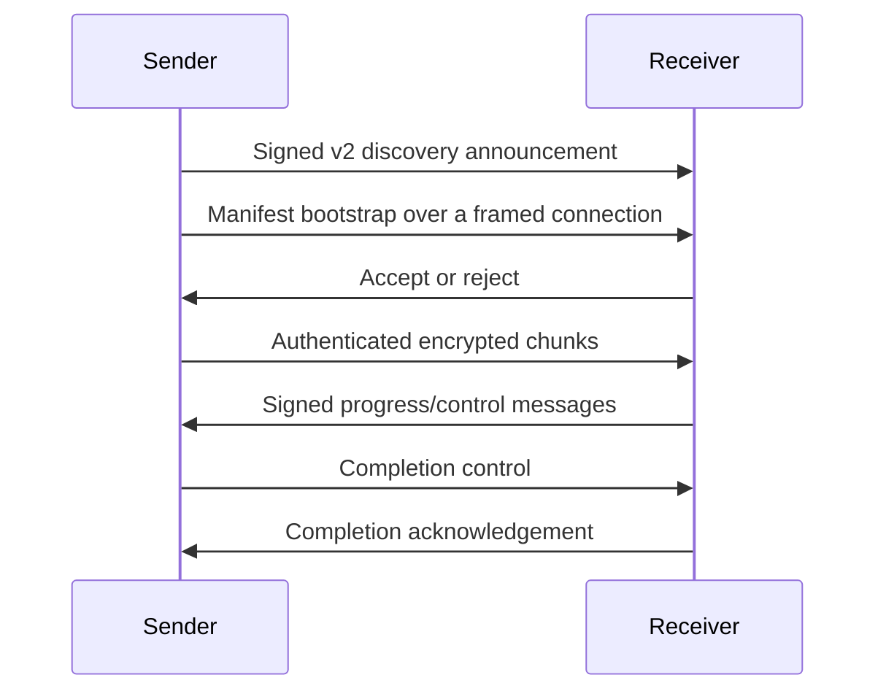

# Nearby Transfer architecture

Nearby Transfer is a local-network file-transfer project with an Electron desktop application, an Android application, npm libraries, a CLI preview, and a limited HTTPS shared-library service.

The `@luo-5/core` package has zero runtime npm dependencies. That statement does not apply to the whole repository: the desktop application uses Electron and the build and test toolchain has development dependencies.

## Current user-facing paths

- Electron desktop file transfer uses the classic encrypted HTTP stream.
- Desktop and Android classic discovery use signed discovery announcement version 2.
- The HTTPS shared-library service is a separate limited WebDAV implementation for supported Nearby Transfer clients after signed session negotiation.
- Protocol-v2 pairing, transfer, persistence, scheduling, and recovery components are implemented as a migration foundation, but the v2 data plane is not the default Electron send/receive path.
- Turbo, QUIC, SMB, a WebDAV transfer driver, and FTPS are roadmap entries only.

The capability matrix is the source of truth for shipped status: [`capabilities.md`](capabilities.md).

## Repository boundaries

- `packages/core`: protocol-v2 primitives and state machines.
- `packages/cli`: developer-preview command-line client.
- `packages/localsend-adapter`: LocalSend interoperability adapter with a separate protocol and trust boundary.
- `packages/protocol-spec`: protocol constants and schema-related material.
- `src/core`: current classic Electron discovery and transfer path.
- `src/v2`: Electron integration adapters and shared-library service.
- `android-app`: Android application and protocol clients.

## Current classic desktop flow

1. A device periodically sends a signed discovery announcement.
2. A sender opens an HTTP transfer-request connection and submits signed metadata.
3. The receiver asks the user to accept or reject the request.
4. On acceptance, the sender streams application-encrypted frames.
5. The receiver writes a temporary file, verifies its final hash, and publishes it without overwriting an existing destination.

## Protocol-v2 target/component flow

The following is the intended v2 component flow. It describes tested library components and the integration target, not the currently selectable Electron path.

## Persistence and publication

Transfer components use task-scoped state and staging paths. A completed file is published only after size and digest verification. Job-store recovery flags describe v2 jobs only; they do not make current classic desktop transfers resumable.

## Shared-library boundary

The shared-library service uses self-signed HTTPS and an application-specific signed session request that returns a Bearer token. It is not advertised as a generic password-based WebDAV mount. The default share is read-only; choosing another folder is the explicit action that enables writes for that configured share.
