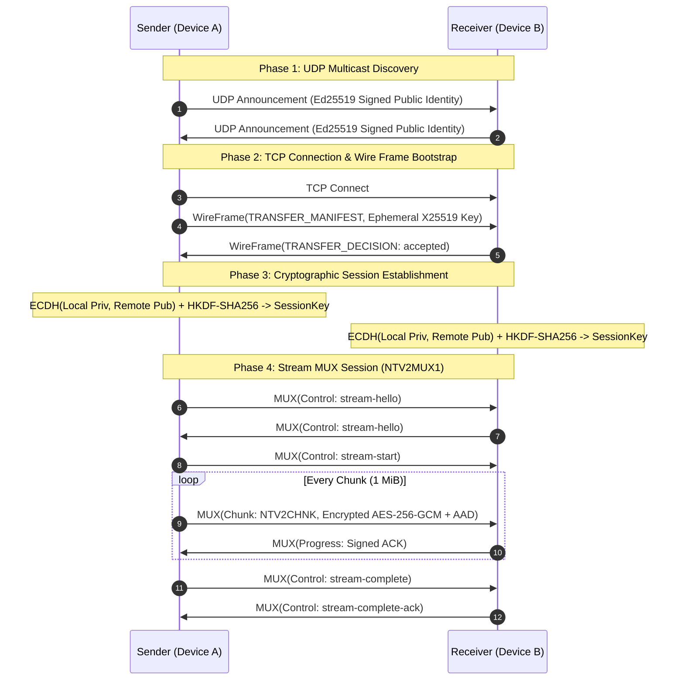

# Nearby Transfer Architecture Document

## 1. System Overview

**Nearby Transfer** is a secure, high-performance, zero-external-dependency local-area network (LAN) file transfer system for desktop (Node.js/Electron), mobile (Android), and NAS (WebDAV) environments.

The system is architected as a modular monorepo:
* **`@luo-5/core`**: Protocol, cryptographic primitives, and state machines with zero runtime npm dependencies.
* **`@luo-5/cli`**: Cross-platform command-line tool (`nearby-transfer`).
* **`@luo-5/localsend-adapter`**: Protocol bridge supporting LocalSend v2 interoperation.
* **`protocol-spec`**: Deterministic protocol specifications and test vectors.

---

## 2. Protocol Layers & Data Flow

---

## 3. Core Component Boundaries

### 3.1 Crypto Subsystem (`packages/core/src/crypto/`)
* **`identity.ts`**: Ed25519 signing keypairs, SHA-256 deviceId derivation (`sha256(pem)[:16]`), and user-friendly fingerprints (`AAAA-BBBB-...`).
* **`session.ts`**: Ephemeral X25519 ECDH key agreement, HKDF-SHA256 context-bound session key derivation, and AES-256-GCM chunk encryption.
* **`timing-safe-compare.ts`**: Constant-time byte and string equality checks.

### 3.2 Discovery Subsystem (`packages/core/src/discovery/`)
* Runs UDP multicast on `239.255.77.77:47777`.
* Announces device name, deviceId, public keys, and capabilities with monotonic timestamps and Ed25519 signatures.
* Handles peer expiration with a sliding TTL (default 10s).

### 3.3 Pairing Subsystem (`packages/core/src/pairing/`)
* Implements Short Authentication String (SAS) 6-digit out-of-band verification.
* Transcripts bind `pairingId`, initiator identity, and responder identity in canonical JSON to defeat Man-in-the-Middle (MitM) attacks.

### 3.4 Transfer Pipeline (`packages/core/src/transfer/`)
* **`bootstrap.ts`**: Handles manifest announcement and acceptance negotiation over wire frames.
* **`stream-session.ts`**: Full-duplex multiplexed streaming session managing chunk transmission, pause/resume, and flow control.
* **`receive-planner.ts`**: Allocates isolated `.nearby-transfer-staging-<taskId>.partial` staging directories and conflict-free target filenames.
* **`encrypted-writer.ts`**: Atomic staging file write, SHA-256 digest validation, and hardlink/rename publication to final paths.
* **`sync-state.ts` & `resume-store.ts`**: Incremental file modification scanning and interrupted transfer checkpoint resumption.
