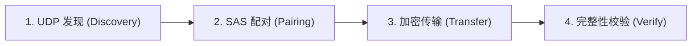

# Nearby Transfer 跨机传输测试方案 (F4)

**测试目标：** 验证 Nearby Transfer 在异构操作系统网络环境下的端到端兼容性与互操作性。  
**目标操作系统组合：**
1. `Ubuntu 22.04 LTS` $\longleftrightarrow$ `CentOS Stream 9 / RHEL 9`
2. `Ubuntu 22.04 LTS` $\longleftrightarrow$ `Windows 11 / Windows Server 2022`
3. `CentOS Stream 9` $\longleftrightarrow$ `Windows 11`

---

## 1. 跨机四步验证流程（每组矩阵）



### 步骤 1：局域网发现 (Discovery)
* **操作**：两端分别启动 `nearby-transfer receive --dir /data` 或 `nearby-transfer devices`。
* **预期**：UDP 多播（`239.255.77.77:47777`）广播互相接收，两端在 2 秒内打印出对端 `deviceName`、`deviceId` 与公钥指纹 `fingerprint`。

### 步骤 2：SAS 视觉配对 (Pairing)
* **操作**：一端执行 `nearby-transfer pair --to <remote-device-id>`。
* **预期**：两端屏幕输出完全一致的 6 位数字短验证码（SAS Code，如 `543440`），确认后自动保存至 `trusted-peers`。

### 步骤 3：加密数据传输 (Transfer / Sync)
* **操作**：发送端执行：
  ```bash
  nearby-transfer send --file test-1gb.bin --to <remote-device-id>
  # 或目录同步
  nearby-transfer sync --dir ./dataset --to <remote-device-id>
  ```
* **预期**：协商成功，切入 MUX 流式传输，实时打印进度条与传输速率（MB/s）。

### 步骤 4：落盘与完整性验证 (Verify)
* **操作**：两端计算并比对 SHA-256：
  * Linux: `sha256sum file.bin`
  * Windows PowerShell: `Get-FileHash -Algorithm SHA256 file.bin`
* **预期**：接收端 staging 文件被原子 hardlink/rename 到最终目录，两端 SHA-256 哈希值 100% 一致。

---

## 2. 异构平台网络与系统排查清单 (Troubleshooting Checklist)

### 2.1 Linux 防火墙 (firewalld / ufw)
* **CentOS / RHEL (firewalld)**：
  ```bash
  # 允许 UDP 多播与 TCP 传输端口
  sudo firewall-cmd --add-port=47777/udp --permanent
  sudo firewall-cmd --add-port=47778-47790/tcp --permanent
  sudo firewall-cmd --reload
  ```
* **Ubuntu / Debian (ufw)**：
  ```bash
  sudo ufw allow 47777/udp
  sudo ufw allow 47778:47790/tcp
  ```

### 2.2 多播路由 (Multicast Routing)
在多网卡（如同时存在 Wi-Fi、以太网、Docker `docker0` 虚拟网卡）机器上：
```bash
# 检查 239.255.77.77 路由出口
ip route add 239.255.77.77 dev eth0
```

### 2.3 Windows 防火墙与网络配置文件
* Windows 默认将新网络识别为“公用网络”（Public），会静默阻止 UDP 组播接收：
  ```powershell
  # 将当前网卡设置为“专用网络”（Private）
  Set-NetConnectionProfile -InterfaceAlias "Wi-Fi" -NetworkCategory Private
  # 添加防火墙入站规则
  New-NetFirewallRule -DisplayName "NearbyTransfer" -Direction Inbound -Protocol UDP -LocalPort 47777 -Action Allow
  ```

### 2.4 Windows 文件系统保留字符与大小写碰撞
* Windows NTFS 不区分大小写且禁止 `\ / : * ? " < > |` 及保留字 `CON`, `NUL`。发送端若来自 Linux，必须经过 `assertValidRelativePath` 净化，以防写入失败。

---

## 3. 跨机自动化回归测试脚本

我们在 `scripts/cross-machine-test.sh` 中提供了自动化执行脚本：

```bash
#!/usr/bin/env bash
set -euo pipefail

REMOTE_HOST="${1:-192.168.1.100}"
REMOTE_DEVICE_ID="${2:-}"

echo "[1/4] Probing discovery on $REMOTE_HOST..."
npx @luo-5/cli devices --timeout 5000

echo "[2/4] Generating 50MB random test payload..."
dd if=/dev/urandom of=/tmp/test_payload.bin bs=1M count=50
SRC_SHA=$(sha256sum /tmp/test_payload.bin | awk '{print $1}')

echo "[3/4] Transmitting payload to $REMOTE_HOST ($REMOTE_DEVICE_ID)..."
npx @luo-5/cli send --file /tmp/test_payload.bin --to "$REMOTE_DEVICE_ID"

echo "[4/4] Verification complete. Source SHA256: $SRC_SHA"
```
